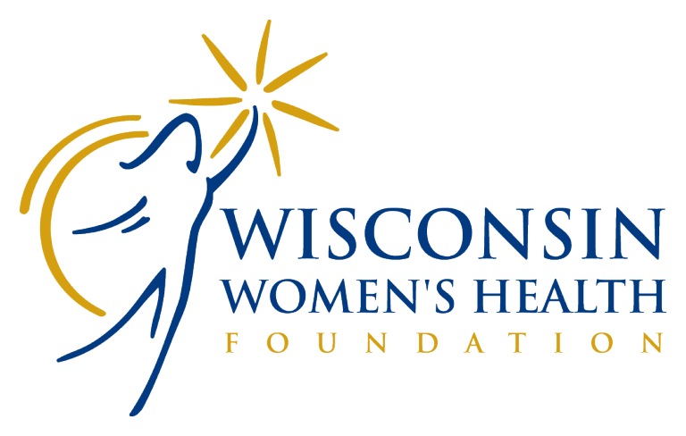

    

The <a href="https://www.wwhf.org/" target="_blank">Wisconsin Women's Health Foundation</a> works throughout the state of Wisconsin to provide smoking cessation programs, breast cancer awareness education and funding for treatment, and a knowledge hub for nursing practitioners targeted around women. In 2016 I began working for WWHF as a remote desktop support specialist. This contract has continued on into 2017 and now includes consulting in the realms of web design, SEO and digital marketing.

